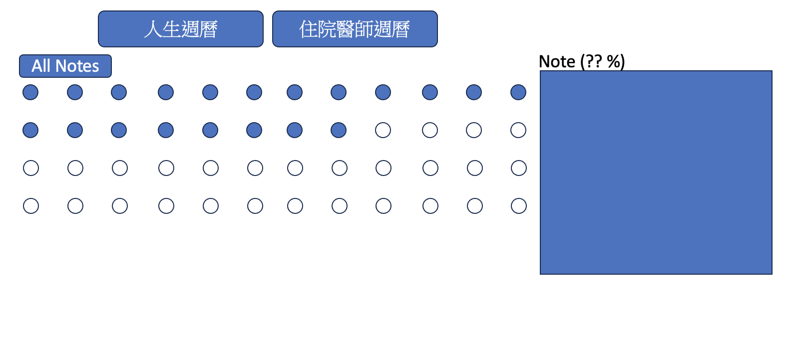

# LifeRecoder

一個視覺化人生進度追蹤的桌面應用程式。用圓點格線呈現人生 80 年（以週為單位）和住院醫師 4 年（以天為單位），讓你一眼看出時間已走了多少。



---

## 功能

- **人生週曆**：52 點 × 80 行 = 4,160 個點，每點代表 1 週
- **住院醫師週曆**：7 點 × 208 行 = 1,456 個點，每點代表 1 天
- 右鍵切換點的上色狀態（已過 / 未過）
- 左鍵開啟 Note 浮動面板，記錄該時間點的文字
- All Notes：檢視所有筆記並可匯出成 `.txt`
- 設定頁面：輸入出生日期 / 住院開始日期，自動填滿過去的點
- 資料存於本地 `~/Documents/LifeRecoder/data.json`，不依賴雲端

---

## 快速開始（開發）

```bash
# 安裝依賴
npm install

# 啟動 APP（開發模式）
npm start

# 打包 macOS .dmg
npm run build:mac

# 打包 Windows .exe
npm run build:win
```

> **注意**：`npm start` 使用 `ELECTRON_RUN_AS_NODE= electron .`，這是為了清除 VSCode 繼承的 `ELECTRON_RUN_AS_NODE=1` 環境變數，否則 Electron 會以純 Node.js 模式啟動而無法運作。

---

## 檔案結構

```
LifeRecoder/
├── main.js          # Electron 主程序
├── preload.cjs      # 安全橋梁（Main ↔ Renderer）
├── renderer.js      # 畫面邏輯
├── index.html       # 主介面 HTML
├── styles.css       # 樣式
├── package.json     # 專案設定與 build 設定
└── assets/
    ├── Main.png     # 主介面設計參考
    └── AllNote.png  # All Notes 介面設計參考
```

---

## 各檔案功能說明

### `main.js` — Electron 主程序（Node.js 環境）

執行在 Node.js 環境中，擁有完整系統權限。

| 功能 | 說明 |
|------|------|
| `createWindow()` | 根據螢幕大小（50% 寬度）建立 BrowserWindow |
| `ipcMain.handle('read-data')` | 從 `~/Documents/LifeRecoder/data.json` 讀取資料 |
| `ipcMain.handle('write-data')` | 將資料寫入 JSON 檔案 |
| `ipcMain.handle('export-notes')` | 開啟系統「另存新檔」對話框，寫出 `.txt` |
| `ensureDataDir()` | 確保資料目錄存在，不存在時自動建立 |

### `preload.cjs` — 安全橋梁

執行在隔離的 context 中，是 Main 和 Renderer 唯一的合法溝通橋梁。

```js
contextBridge.exposeInMainWorld('electronAPI', {
  readData:    () => ipcRenderer.invoke('read-data'),
  writeData:   (data) => ipcRenderer.invoke('write-data', data),
  exportNotes: (text) => ipcRenderer.invoke('export-notes', text)
})
```

Renderer 只能呼叫這三個被明確暴露的方法，無法直接存取 Node.js 或檔案系統。

### `renderer.js` — 畫面邏輯（瀏覽器環境）

| 功能 | 說明 |
|------|------|
| `init()` | 讀取資料、啟動 ResizeObserver、渲染格線 |
| `renderGrid()` | 根據當前模式生成所有 DOM 點元素 |
| `updateDotSizes()` | 計算最大能填滿畫面的點大小，注入 CSS 變數 |
| `handleDotClick()` | 左鍵：開啟浮動 Note 面板 |
| `handleDotRightClick()` | 右鍵：切換上色狀態並儲存 |
| `showNotePanel()` | 在浮動面板顯示筆記輸入介面 |
| `showAllNotesPanel()` | 在浮動面板顯示所有筆記清單 |
| `autoFillLife()` | 根據出生日期計算週數，自動上色過去的點 |
| `autoFillResidency()` | 根據開始日期計算天數，自動上色過去的點 |
| `saveData()` | 呼叫 `window.electronAPI.writeData()` 儲存至 JSON |

### `index.html` — 主介面 HTML

定義 APP 骨架結構：Header（Tab 列）、格線區域、浮動 Note 面板、設定 Modal。所有動態內容由 `renderer.js` 填入。

### `styles.css` — 樣式

| 重點 | 說明 |
|------|------|
| `--dot-size`, `--dot-gap`, `--dot-border` | CSS 自訂屬性，由 JS 動態設定，控制全域點的大小 |
| `.layout-life` | CSS Grid `1fr 1fr`：人生週曆 2 欄排列 |
| `.layout-residency` | CSS Grid `repeat(8, 1fr)`：住院醫師 8 欄排列 |
| `.float-panel` | `position: fixed` 浮動 Note 面板，不佔版面空間 |
| `.modal-overlay` | 設定頁面的全螢幕遮罩 Modal |

### `package.json` — 專案設定

- `scripts.start`：`ELECTRON_RUN_AS_NODE= electron .`（清除環境變數再啟動）
- `build` 欄位：electron-builder 打包設定，指定要包含的檔案和輸出格式

---

## 技術要點

### Electron 三層架構

```
Main Process  ←──IPC──→  Preload Script  ←──contextBridge──→  Renderer Process
  (Node.js)                  (橋梁)                               (瀏覽器)
  可存取檔案系統              精確控制暴露什麼                    只能用被暴露的 API
```

Renderer 無法直接碰系統資源，所有操作都必須透過 IPC 傳遞到 Main Process 執行。這是 Electron 的核心安全設計。

### IPC 通訊（invoke / handle）

```js
// Renderer：發送請求，等待回應
const data = await window.electronAPI.readData()

// Main：註冊處理函式，return 值會傳回 Renderer
ipcMain.handle('read-data', () => {
  return JSON.parse(fs.readFileSync(dataFile, 'utf-8'))
})
```

`invoke` 回傳 Promise，適合需要等待結果的操作（檔案讀寫、對話框）。

### CSS 自訂屬性 + ResizeObserver

用 JavaScript 計算後注入 CSS 變數，讓所有點自動依視窗大小縮放：

```js
const ro = new ResizeObserver(() => updateDotSizes())
ro.observe(container)

// 改一個變數，4160 個點全部更新
document.documentElement.style.setProperty('--dot-size', `${dotSize}px`)
```

相較於逐一修改每個點的 style，CSS 變數只觸發一次 reflow，效能更好。

### CommonJS（.cjs）vs ES Module

本專案使用 CommonJS（`require()`），preload 用 `.cjs` 副檔名強制指定。Electron 的 ESM import（`import { app } from 'electron/main'`）僅在 ASAR 打包後有效，開發階段以 CJS 最穩定。

### electron-builder 打包

```json
"build": {
  "files": ["main.js", "preload.cjs", "index.html", "renderer.js", "styles.css"],
  "mac": { "target": "dmg" },
  "win": { "target": "nsis" }
}
```

打包後的 `.app` / `.exe` 內含完整 Chromium + Node.js，使用者不需安裝任何環境即可執行（約 80–100 MB）。

---

## 資料格式

資料存於 `~/Documents/LifeRecoder/data.json`：

```json
{
  "life": {
    "dots": {
      "0":  { "colored": true,  "note": "出生" },
      "42": { "colored": true,  "note": "" }
    }
  },
  "residency": {
    "dots": {
      "0": { "colored": true, "note": "第一天" }
    }
  },
  "settings": {
    "birthDate": "1995-06-15",
    "residencyStartDate": "2024-07-01"
  }
}
```

`dots` 的 key 是點的索引（從 0 開始），只有被操作過的點才會出現在檔案中，未操作的點不儲存。

---

## 系統需求

| 平台 | 需求 |
|------|------|
| macOS | 10.13 以上 |
| Windows | Windows 10 以上 |

開發環境需要 Node.js 16+。
